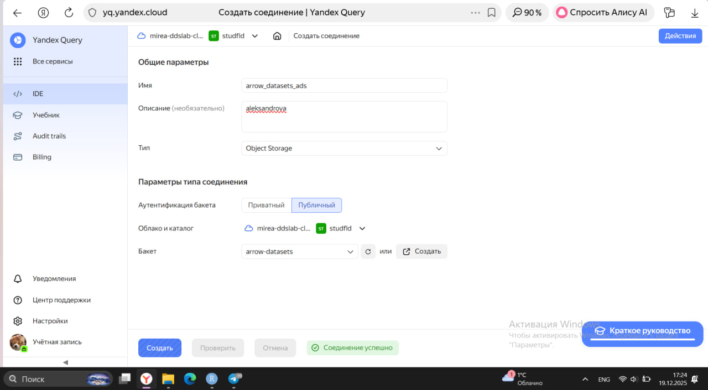
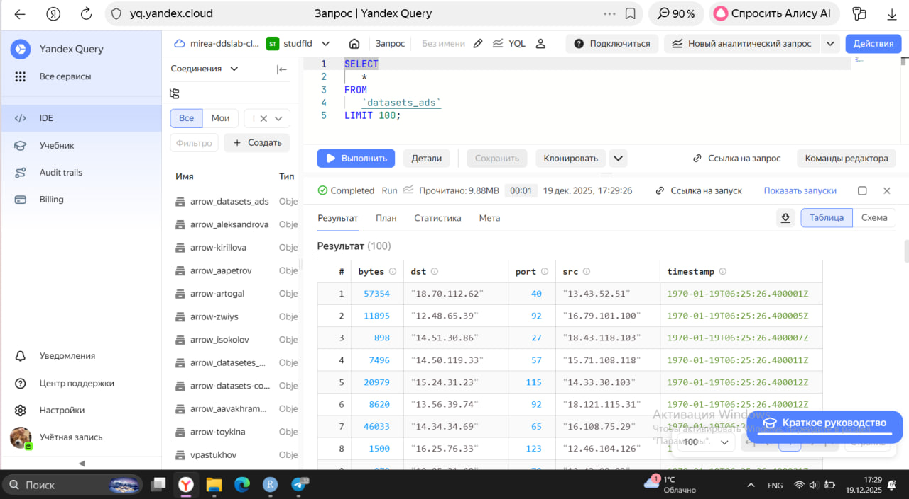
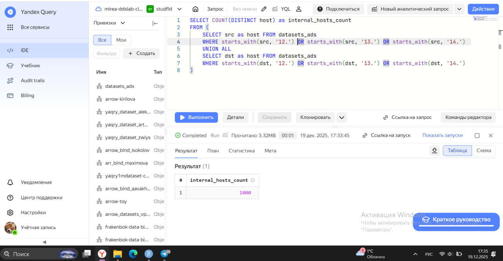
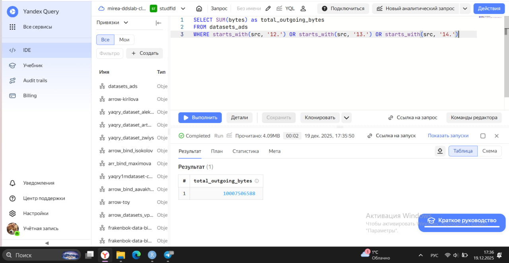
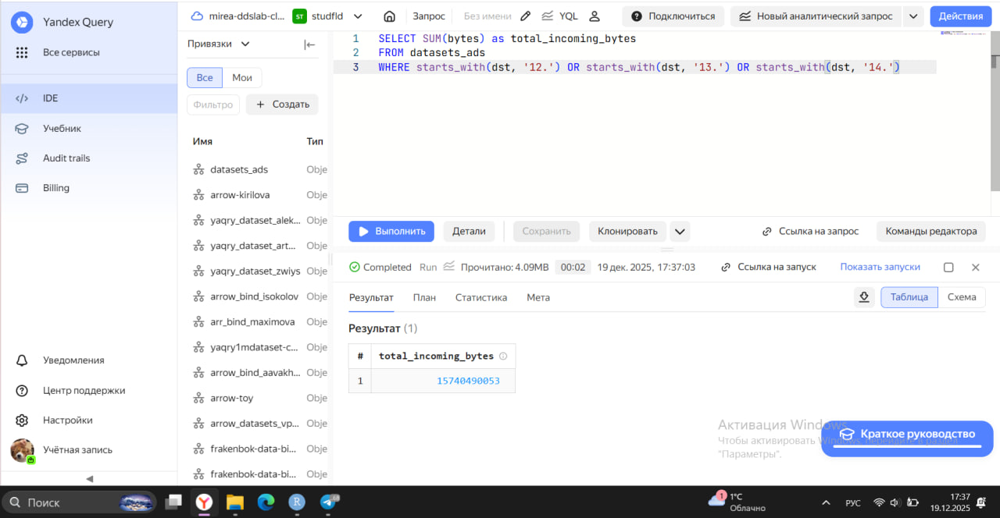

# Использование технологии Yandex Query для анализа данных сетевой
активности
deesshii@yandex.ru

## Цель работы:

1.  Изучить возможности технологии Yandex Query для анализа
    структурированных наборов данных
2.  Получить навыки построения аналитического пайплайна для анализа
    данных с помощью сервисов Yandex Cloud
3.  Закрепить практические навыки использования SQL для анализа данных
    сетевой активности в сегментированной корпоративной сети

## Исходные данные

1.  Программное обеспечение Windows 10
2.  Rstudio Desktop
3.  Наше рабочее окружение

``` r
sessionInfo()
```

    R version 4.5.2 (2025-10-31 ucrt)
    Platform: x86_64-w64-mingw32/x64
    Running under: Windows 11 x64 (build 26100)

    Matrix products: default
      LAPACK version 3.12.1

    locale:
    [1] LC_COLLATE=Russian_Russia.utf8  LC_CTYPE=Russian_Russia.utf8   
    [3] LC_MONETARY=Russian_Russia.utf8 LC_NUMERIC=C                   
    [5] LC_TIME=Russian_Russia.utf8    

    time zone: Europe/Moscow
    tzcode source: internal

    attached base packages:
    [1] stats     graphics  grDevices utils     datasets  methods   base     

    loaded via a namespace (and not attached):
     [1] compiler_4.5.2    fastmap_1.2.0     cli_3.6.5         tools_4.5.2      
     [5] htmltools_0.5.8.1 rstudioapi_0.17.1 yaml_2.3.10       rmarkdown_2.30   
     [9] knitr_1.50        jsonlite_2.0.0    xfun_0.54         digest_0.6.37    
    [13] rlang_1.1.6       evaluate_1.0.5   

## План

Проверить доступность данных в Яндекс.Облачном хранилище 1.1. Проверить
доступность данных (файл yaqry_dataset.pqt) в корзине arrow-datasets S3
хранилища Яндекс.Облачное хранилище.

Подключить бакет в качестве источника данных для Yandex Query 2.1.
Создать соединение для бакета в хранилище S3 (заполнить поля с учетом
допустимых символов, выбрать тип аутентификации — публичный. Ввести имя
бакета в соответствующее поле и сохранить ) 2.2. Создать и настроить
привязку (указать, какой объект использовать в качестве источника
данных).

Анализ 3.1. Известно, что IP-адреса внутренней сети начинаются с
октетов, принадлежащих интервалу 12–14. Определить количество хостов
внутренней сети, представленных в наборе данных. 3.2. Определить общий
объем исходящего трафика. 3.3. Определить общий объем входящего трафика.

## Шаги:

Шаг 1

Проверим доступность данных Перейдём по ссылке и проверим доступность
данных

    dataset_path <- "https://storage.yandexcloud.net/arrow-datasets/yaqry_dataset.pqt"
    > local_file <- "yaqry_dataset.pqt"
    > if (!file.exists(local_file)) {
    +   tryCatch({
    +     download.file(url = dataset_path, destfile = local_file, mode = "wb")
    +     message("Файл успешно загружен")
    +   }, error = function(e) {
    +     stop("Ошибка при загрузке файла: ", e$message)
    +   })
    + }
    > 
    > net_traffic <- arrow::open_dataset(local_file, format = "parquet")

Шаг 2 Создадим соединение для бакета в S3 хранилище

 

Шаг 3 Известно, что IP адреса внутренней сети начинаются с октетов,
принадлежащих интервалу \[12-14\]. Определите количество хостов
внутренней сети, представленных в датасете. Составим следующий запрос:
 Шаг 4 Определите суммарный объем исходящего трафика
Составим следующий запрос:  Шаг 5 Определите суммарный
объем входящего трафика Составим следующий запрос:  \##
Оценка результата

В рамках данной практической работы было исследовано использование
технологии Yandex Query для анализа данных сетевой активности.

## Вывод

В ходе практической работы мы познакомились с сервисами Yandex Cloud,
изучили возможности технологии Yandex Query для анализа
структурированных наборов данных, а также что такое S3 хранилище и как
им пользоваться.
